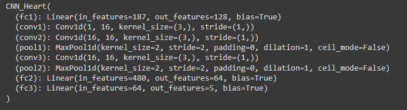

# Identify irregular heartbeats with CNNs

How to identifiy irregular heartbeast based in the kaggle fdata available in: 
https://www.kaggle.com/rkuo2000/ecg-classification

## Content of this repository

- ECG_Kaggle. 
	
	You have two ways to find the data for the model you can download the KAggle database or you can use the csv files which links are in the link2data.txt file. 

- .py files
	- Start with *data_preparation.py* to see how the data is orrganized in the files.
	- In *model.py* you will finde the CNN model and the DAtaset class for the training.

- .pth files
	- Here are the finished saved trained models.

## Data Check

We check the data that is available. We can see that the most of the data is of normal and therefore the model will be inbalanced and the model will tend to consider abnormal heartbeats as normal. Because my target in this exercise is to use 1-D CNN I will obviate this. 

Actually the imbalance is so big that I would personally try to develop two models, one taht detects the anomaly. And otehr one taht detects the type of anomaly.  

Otehr 

If analised all the signal with the variance and the mean, we can see that there are differences among them, and enought to be able to detect the abnormal beats.

## Training

The model has been trined using a 1-D Convolutional network 

After training for 30 epochs, we can see that the Validation loss is stabiliced and the Training Loss is still descending. So 30 is a good number to avoid overfitting the model.

## Results 

The overall accuracy is over 97%. But we have to look between the lines.

There is a 2% of hearbeats with problems that are classified as normal when they are not, probably an effect of the inbalances datases. In a case like this the values are not good.

But digging deep in the data there are in two categories 25% with abnormal hertbeat classified as normal.

|Type of Hearbeat | Accuracy  | False Positives | Heart Troubles Classisified as Normal|
|-|-|-|-|
|Normal (0) | 99.08%| 2.06% | --|
|Premature Supraventricular (1) |70.74% | 17.74%|27.65%|
|Premature Ventricular (2) |87.61% |4.96% |8.97%|
|Fusion ventricular and normal (3) |62.02% |13.18% |25.58%|
|Unclassificable (4) | 96.05% |4.25% |3.17%|

The purpose of this exercise was for me to learn how it is possible to use 1-D COnvolutional Networks to identify anomalies or for classification, so as I said before I will improve the models with balancing the data and creating 2 models out of it, if I have time to do so.